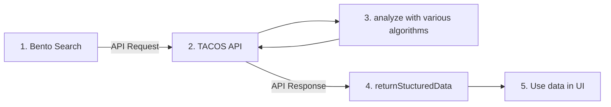

# 3. Implement as a GraphQL API

Date: 2023-07-14

## Status

Accepted

## Context

In early design exercises, we envisioned TACOS more in terms of the staff workflow of analyzing search terms. In the
longer term, we would also want the tool to be able to evaluate search terms algorithmically.

In either case, the tool should be able to return its evaluation of a search term to a search interface, so that
interface can better detect user intent. An API will allow for any discovery interface to programmatically request data
about search terms, and for TACOS to return that data efficiently and in a structured format.

The basic flow might look like this:

1. A user pastes a citation into the Bento input field and executes a search.
2. Bento asks TACOS (possibly via ActiveRecord callbacks) to analyze the search term.
3. TACOS evaluates the search term and hopefully identifies it as a citation.
4. TACOS returns its evaluation to Bento.
5. In the search results, Bento shares its best guess as to what the user was searching for. In this case, it would be
a link to the article, but it might also be a database or journal, a library service offering, or contact information
of a subject matter expert in the libraries.

This pattern would also replace the 'fact' feature built into the TIMDEX UI. In other words, TACOS would be responsible
for matching DOIs, ISBNS, ISSNs, and other identifiers that could resolve known-item searches whereas consuming
applications such as TIMDEX UI would be responsible for presenting the information in a useful way.

### GraphQL vs REST

We have familiarity with both GraphQL and REST, and either option is a viable choice for this API. We are ignoring other
specifications, such as JSON:API, which are not not worth pursuing as they would slow down initial development and are
unlikely to add significant value.

#### REST

For a single endpoint API like we are imagining, the simplicity of REST is a nice benefit. We are imagining minimal parameters and a single structured JSON data response and REST is very clean to use for this purpose.

REST is a ubiquitous architectural style that is more established than GraphQL. If we plan to make TACOS something that
other organizations can fork and customize for their own needs, then REST will lower the barrier to engage with the
codebase.

If we choose REST, we should assume we'll need to include a breaking version at some point in the future and start our routes versioned (i.e. `/api/v1?searchterm?=` rather than just `/?searchterm=`).

#### GraphQL

GraphQL requires a bit more care to implement from a consumption perspective as it is likely we'd break each portion of the structured JSON data into an optional returned value so consumers would need to explicitly ask for the data they plan to use. This can also be a benefit as we'd only send consumers the data they need, so while there is friction it is fairly small once consumers embrace how GraphQL works.

GraphQL would allow us to have an interactive dashboard, GraphiQL, similar to what we have for TIMDEX to allow for an easy way to see responses from the API in a simple, self documenting web UI.

While we don't anticipate a need for this so early on, GraphQL's use of deprecation instead of versioning could come
in handy if this API is long lived. We were able to leverage this well in TIMDEX.

Setting up GraphQL enpoints intially would be a bit more work than REST, but we have experience on our team doing this so it is not a blocker.

The ability to return individual fields in GraphQL could result in significant performance gains. Some algorithms may
have a higher cost than others, such as those that must call an external API for additonal information about a term. If
we run these algorithms selectively based on what a consumer requests, we could substantially improve the API's
performance.

## Decision

We will implement the functionality to return search term evalutions as a GraphQL API.

## Consequences

By making this decision, we are forgoing the added simplicity and familiarity that REST provides. However, for this use
case, the value added by GraphQL's self-documentation and selective returning of fields outweighs these advantages.
