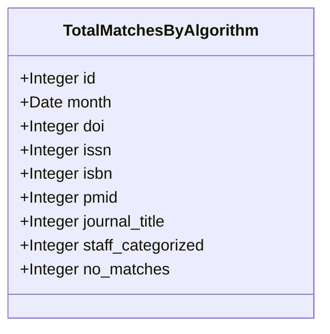
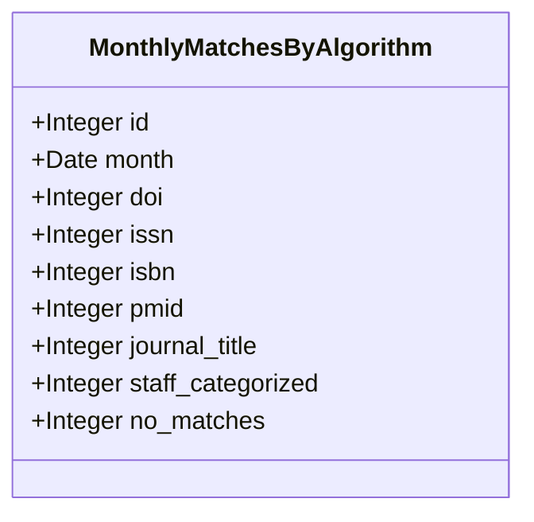
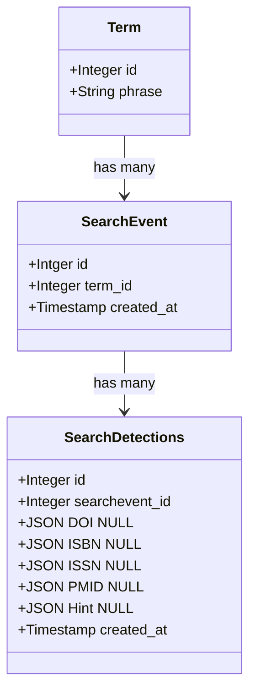
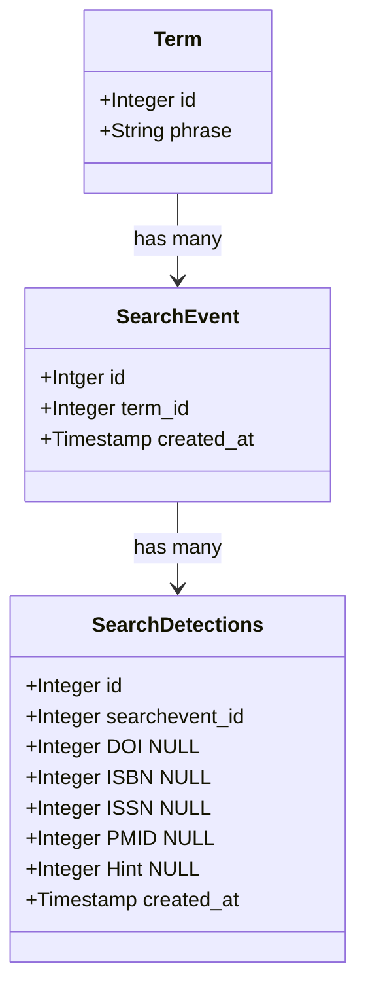

# 5. Use multiple minimal historical analytics models

Date: 2024-06-20

## Status

Accepted

## Context

Knowing how TACOS is doing over time will be important to ensure we can understand our progress in this strategic endeavor.

### Potential ways to approach this problem

#### Monthly checks of all data against all current algorithms

While our data volume is low, we can likely just create some tasks that will run the entire backlog of terms against each of our detection algorithms and record the total number of matches each returns and store those results in the database.

This might result in data that looks something like:

|   | DOI  | ISSN  | ISBN  |  PMID | Journal Title  | Staff categorized term  | No matches  |
|---|---|---|---|---|---|---|---|
|  June 2024 | 10  | 20  | 3  | 2  | -  | -  | 6,000  |
|  July 2024 | 20  | 30 | 7 | 5  | -  | -  | 15,000  |
|  Aug 2024 | 45  | 40 | 11  | 12  | 12,000  | -  | 9,000  |
|  Sept 2024 | 60  | 70 | 21  | 33  | 22,000  | 100  | 15,000  |
|  ...etc |   |   |   |   |   |   |   |

As the table shows checks every term with every current algorithm, each month the numbers generally increase as new terms are searched for. This also has the benefit of looking at how new algorithms would have behaved with older data, such as when "Journal Title" was introduced the number of "No matches" dropped significantly in this hypothetical scenario.

##### Class diagram for Total Matches By Algorithm

It is possible a single searchterm shows up in counts for multiple rows. For instance a citation may include both a DOI and a Journal Title... and potentially in the future a "citation" match.

#### Monthly checks of current data against all current algorithms

Similar to the previous approach, this approach allows us to look at how our algorithms are doing.

A table might looks something like:

|   | DOI  | ISSN  | ISBN  |  PMID | Journal Title  | Staff categorized term  | No matches  |
|---|---|---|---|---|---|---|---|
|  June 2024 | 10  | 20  | 3  | 2  | -  | -  | 6,000  |
|  July 2024 | 10  | 10 | 4 | 3  | -  | -  | 9,000  |
|  Aug 2024 | 25  | 10 | 4  | 7  | 5,000  | -  | 1,000  |
|  Sept 2024 | 15  | 30 | 10  | 11  | 5,000  | 100  | 900  |
|  ...etc |   |   |   |   |   |   |   |

In this case, each row is only focused on the Terms that had SearchEvents during the month being analyzed so we don't have an ever growing number of terms to check each month. This comes at the cost of not fully understanding how new or adjusted algorithms would perform with historical search terms.

##### Class diagram for Monthly Matches by Algorithm

This approach is likely complementary to the "count all matches" approach and as both store minimal data it is possible we should do both. It is likely a single pass through all Terms could populate both tables if a lookup were done to see if the Term had a SearchEvent. Care would need to be taken to not create an N+1 SQL query if doing this in a single job but it should be possible.

#### Detections table with verbose data about matches

A more verbose way to record detections from our algorithms might be a log-like table that ties to SearchEvents.

##### Class diagram for verbose Detections Table

We already have a record of every time we’ve seen a given search for any phrase - adding a table (or even fields in the SearchEvent table) for each detector we build would allow us to have a record of whether each detector fired, and what it returned. Setting a default value of NULL on each field, but storing an empty non-NULL value via code, would allow us to query for failures to detect (which would be stored as {} separately from any search prior to that detector being in place (which would be stored as NULL values).

An approach like this, which doesn’t generate only counts but also the details of what is detected / returned, would provide greater visibility into application performance - but at the cost of needing to be recorded at query time, and not as a batch retroactively.

This stores a lot more data and it isn't clear what we would use it for. This approach should likely be implemented in the future if we find we have a specific question that can only be solved with this level of detail. We would lose historical data if we wait to implement this, but that risk is outweighed by avoiding storing a bunch of data without a clear purpose.

#### Detections table with only match status stored

This approach takes the pros of the detections table presented above, and eliminates storing extra JSON responses and moves to just storing a simple value:

- 0 = no match
- 1 = match
- null = did not run (will be set by default when we introduce algorithms after the SearchEvent is created. We'd not set this explicitly)

##### Class diagram for Simplified Detections Table

## Decision

We'll use a combination of approaches.

Specifically, we'll implement:

- Monthly checks of all data against all current algorithms
- Monthly checks of current data against all current algorithms
- Detections table with only match status stored

Neither of the Detections table approaches provide context as to how our new algorithms would do with older Terms.

The `Detections table with only match status stored` option in theory could simulate the `Monthly checks of current data against all current algorithms` but having these in an aggregate table will be minimal work and allow us to not lose data if for some reason we choose to purge the SearchEvent data after a certain time period of usefulness.

## Consequences

By using all three of the fairly simple versions, we should get data that helps us understand how our algorithms are doing.

With the two monthly aggregations, we see both how our algorithms do with all data the system has ever seen and how they did with the most current data. Comparing those will be useful in understanding whether we are algorithms are only useful for older data or if they continue to be useful for current data.

We get an additional perspective by using the Detections table in that we can look at how a specific Term does over time. This ability to drill down and look at a Term over time should give us insight into how our system is working in a way the aggregate data can only hint at. By using the simplified version of Detections table, we do lose out on know exactly what we responded with, but as we don't have a clear use case for that now we should accept that risk and if it becomes essential in the future we can adjust what we store for data going forward.
