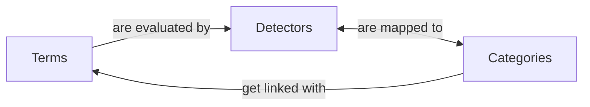
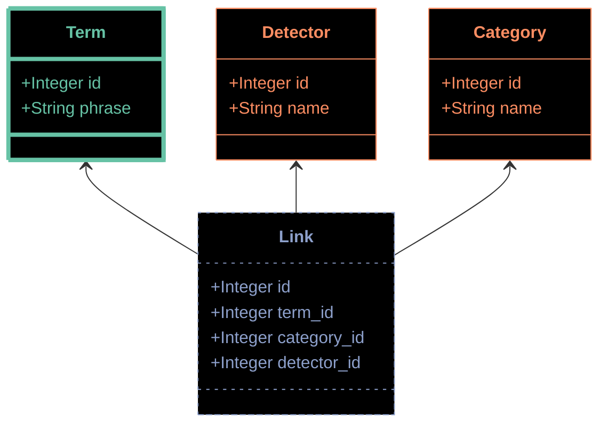
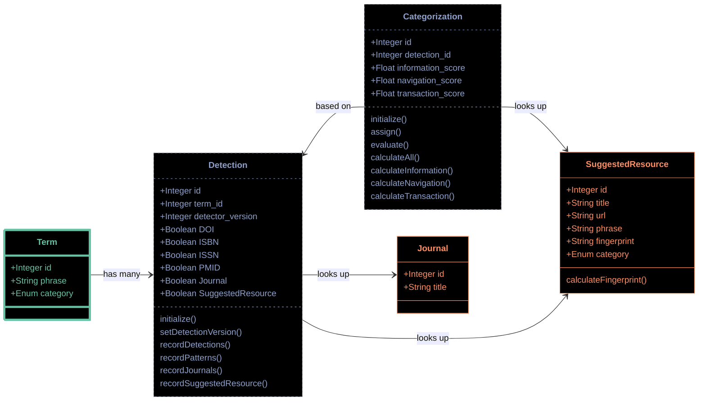
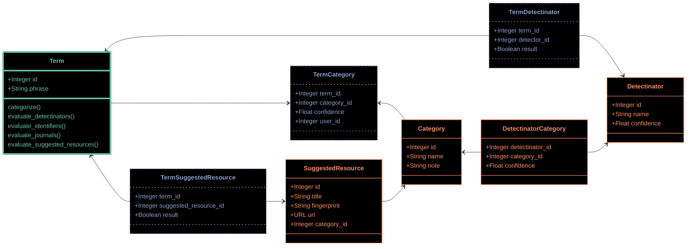
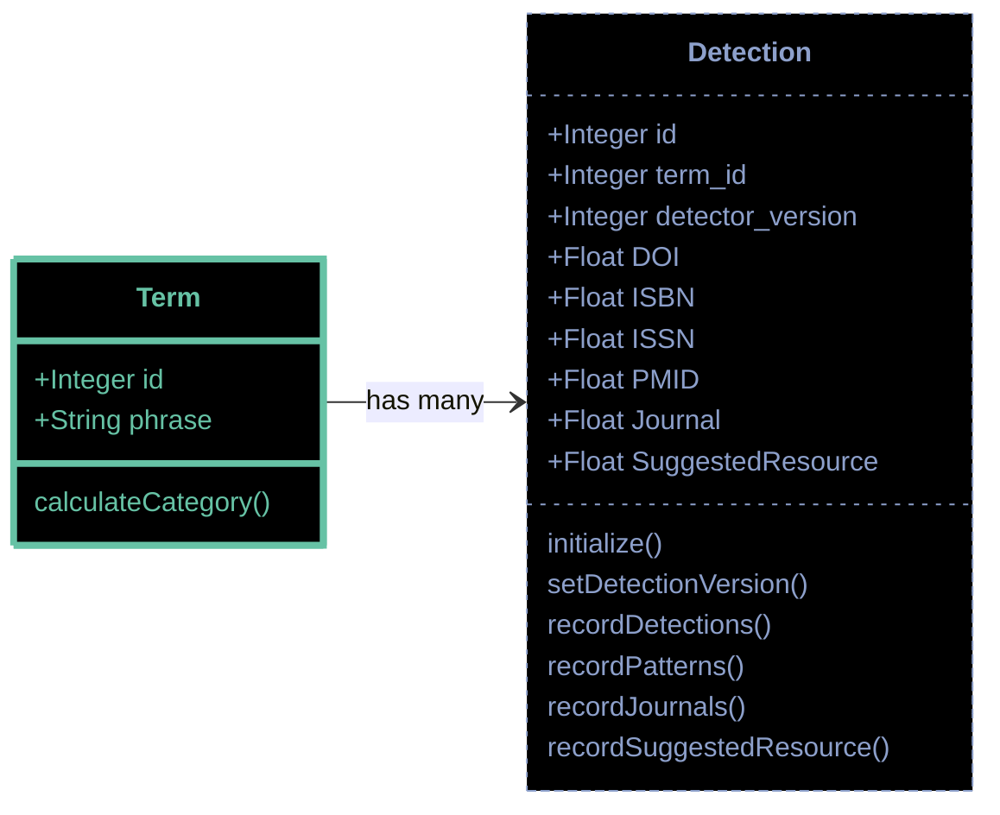
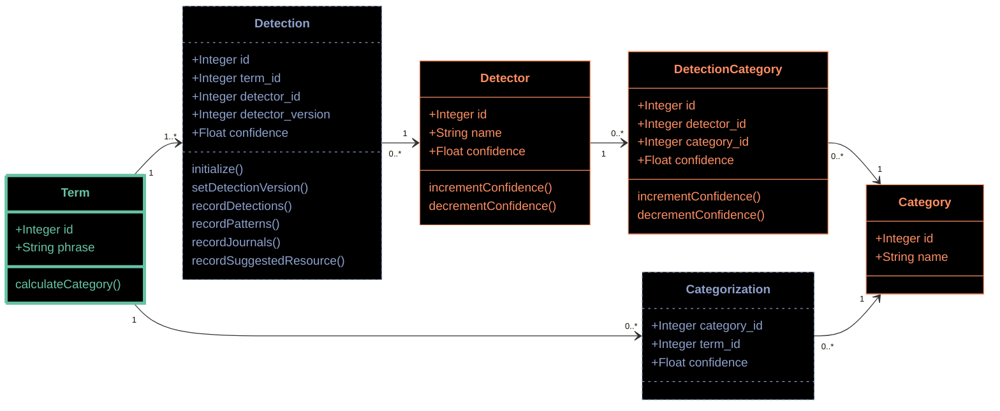

# 9. Define categorization architecture

Date: 2024-09-06

## Status

Accepted

## Context

We need to define the data model and workflow for TACOS and its users to place search terms into categories. This
includes a discussion about how those categories themselves will be represented (and what they are), and how existing
structures like Detectors contribute to that categorization activity.

A future decision, which should be considered now although not yet resolved, is how to enable users to validate these
categorization actions.

### The relationship between Terms, Detectors, and Categories

At a very high level, TACOS works according to the following flowchart:

Search terms are received from a contributing system, and are evaluated by a set of Detectors which look for specific
patterns. Those Detectors are mapped to one or more Categories. As a result of these detections and their relationship
with each category, TACOS is able to calculate the strength of the link between each term and category.

The decision being documented here is how we achieve this relationship.

## Options considered

We evaluated multiple ways of implementing these relationships through prototyping, diagramming, and extensive
discussions. Each are documented here.

Each of the options described below uses the same graphic language:

* Terms, which flow in continuously with Search Events;
* A knowledge graph, which includes the categories, detectors, and relationships
  between the two which TACOS defines and maintains, and which is consulted during categorization; and
* The linkages between these terms and the graph, which record which signals are
  detected in each term, and how those signals are interpreted to place the term into a category.

A simple way to describe the Categorization workflow would be to say that Categorization involves populating the blue
tables in the diagrams below.

### Prototype Zero

The simplest option to relate these elements is a single three-way join model, which would have pointers back to each
of the Term, Detector, and Category models.

This option was rejected almost immediately because it does not allow for enough flexibility and would spawn far too
many extraneous records.

### Prototype A

The "A" prototype defined its linking records in two large models. The `Detection` model would record the relationship
between every `Term` and each detector in the application, with a field for each output. The `Categorization` model
would then build upon those detections, with a field for a calculated score according to each category. The category
with the highest score would finally be stored in the `Term` model for better performance.

The knowledge graph in this prototype would be comparatively sparse, with models for each lookup-style detector. The
relationships between detectors and categories would be defined directly within methods in the `Categorization` model.

A benefit of this prototype is that the `Detection` and `Categorization` models would be very intuitive to work with,
and allow for repeated classification as our application evolves. Querying these models from the controller level would
be very simple.

An area of uncertainty in this prototype was how to calculate confidence values and categorization scores for each
detector and category. We discussed multiple options for this question, but ultimately did not decide on a single
approach.

### Prototype B

The "B" prototype makes a different choice for recording both the knowledge graph, and the linkages to the terms flowing
into the application. The knowledge graph is more explicitly modeled in the database, with models for `Category`,
`Detectinator`, and the `DetectinatorCategory` model which maps between the two.

Because each of these records are now separate entries, this prototype further breaks up the large models for detection
and categorization outputs. The detection result is spread across multiple records in the `TermDetectinator` and
`TermSuggestedResource` models. The final categorization process is also recorded in multiple `TermCategory` records.

Because of this dispersion of information across multiple records, the methods needed to do the work end up being
defined in the `Term` model - shown here as methods like `evaluate_detectinators()` and `categorize()`.

One immediate advantage of this approach is that we have appropriate fields in the knowledge graph for storing
confidence values, which would be multiplied together to generate the final `score` value that is recorded in the
`TermCategory` records.

A drawback to this prototype is the duplication between the Detectinator and SuggestedResource models (remembering that
SuggestedResource is one of the application's detectors). While this set of models was meant to allow different
SuggestedResource records to be affiliated with different categories, that feature can be supported via code, rather
than relying on the data model.

### Prototype C

The "C" prototype was a further evolution of the "A" prototype, which attempted to combine all detection and 
categorization outputs in a single model. By changing the `Detection` table to storing floats rather than boolean
values, we attempted to reduce the number of models needed in the application.

Development of this prototype was halted fairly early, after realizing that the calculation of categorization values
would not necessarily be helped by combining models in this way.

### Prototype D

The "D" prototype was a further evolution of the "B" prototype, focused primarily on removing the separate structures
for SuggestedResources. There is still a knowledge graph spread across Detectors, Categories, and the mapping between
them. Detection and Categorization results are also spread across multiple link records.

Further refinements in this prototype are the inclusion of a `detector_version` value in the Detection model, and the
removal of a `user_id` field from the Categorization model (we are still debating the role of user-supplied 
categorizations, compared to the user-supplied validation of existing categorizations).

The significant benefit of this prototype is the removal of the SuggestedResource models, which leaves a more
straightforward data model which records only Detectors and Categories, without special consideration for any one
Detector.

## Decision

We will pursue the "D" prototype, with explicit models for the application's knowledge graph, and detection and
categorization outputs spread across linking records rather than concentrated in a single record.

## Consequences

There are still unknowns which we will confront while implementing this design. Among those are how the user permissions
model will intersect with these models, and how the controller and view layers will be defined to enable this to
function. Additionally, while we have discussed the process of calculating confidence values, it may be that writing
this implementation may reveal shortcomings we have not yet realized.

Our commitment at this stage, due to these uncertainties, is that we will further develop the "D" prototype by
attempting to implement it. Only time will tell whether we will successfully do so, or if we will need to change course.
