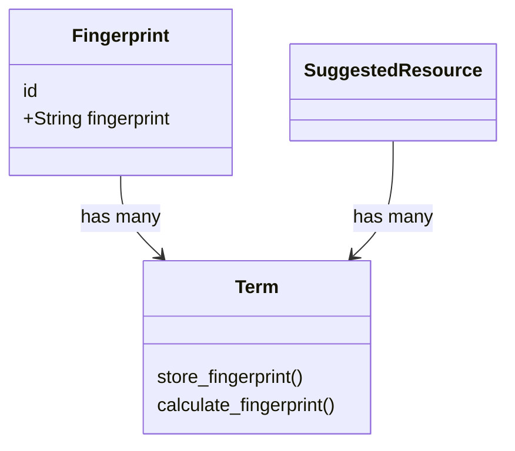

# 10. Associate `SuggestedResource` and `Term` models

Date: 2024-11-19

## Status

Accepted

## Context

TACOS currently uses fingerprinting to determine matches for suggested resources. We are considering using a similar
pattern to support clustering of terms, and we need to refactor `SuggestedResource` to accommodate multiple
phrases/fingerprints per resource. These converging needs prompted a discussion about whether it would be useful to
consolidate fingerprinting into a single model.

## Options considered

### `TermFingerprint` and `SuggestedResourcePhrases`

One solution would be to implement the fingerprinting logic in two separate models: `TermFingerprint` would store
fingerprints for the `Term` model, and `SuggestedResourcePhrases` would store fingerprints and phrases for the
`SuggestedResource` model. [Matt has opened a PR](https://github.com/MITLibraries/tacos/pull/138) showing what the
`Term` side of this would look like.

This approach would introduce some redundancy, which we could mitigate by abstracting shared code to a module. Neither
model has unique fingerprinting needs, so they can use the same algorithm. (The additional quotation handling in Matt's
PR would not affect the `SuggestedResource` use case.)

An advantage to this solution is allowing suggested resources to continue to store their own phrases, separate from
the `Term` table. This precludes the risk of accidentally deleting a term that's associated with a suggested resource.

### Associate `SuggestedResource` and `Term` models

This redesign would create a `Fingerprint` model associated with `Term`, to support the clustering use case. It would
add an association between `SuggestedResource` and `Term`, such that a suggested resource's phrase would be stored
in the `Term` table, and matches would be identified by consulting `Fingerprint`.

Allowing suggested resources to leverage the newly created `Fingerprint` model would minimize redundancy. Further,
connecting suggested resources to terms would enable some useful reporting. For example, since terms are connected to
search events, we would be able to query which search events triggered a given suggested resource detector.

It's likely that other detectors would make use of fingerprinting, so this approach would also help us plan for future
use cases.

## Decision

We will create a single `Fingerprint` model, associated with the `Term` model, and link `SuggestedResource` to `Term`
(note that only newly added fields and methods are listed):

## Consequences

By drawing phrases from the `Term` table, there is a risk that a deleted term would leave a suggested resource without
any phrases or fingerprints. We should add a foreign key constraint to mitigate this.
