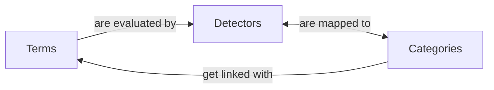

# Categorization workflow

## Conceptual diagram

There are three basic models which we are attempting to relate to each other:
Terms, Detectors, and Categories. The relationship looks like this:

## Example data

### Terms

| id | phrase                                |
|----|---------------------------------------|
| 1  | web of science                        |
| 2  | pitchbook                             |
| 3  | vaibbhav taraate                      |
| 4  | doi.org/10.1080/17460441.2022.2084607 |
---

We have received more than 40,000 unique search terms from the Bento system in
the first three months of TACOS' operation.

### Categories

| id | name          | note                                                                                      |
|----|---------------|-------------------------------------------------------------------------------------------|
| 1  | Transactional | The user wants to complete an _action_ (i.e. to receive an item)                          |
| 2  | Navigational  | The user wants to reach a _place_ which might be a web page, or perhaps talk to a person. |
| 3  | Informational | The user wants _information_ about an idea or concept.                                    |

Thus far, we have only focused on these three categories of search intent. It
should be noted that the SEO literature references additional categories, such
as "commercial" or "conversational".

Additionally, some of these categories may be sub-divided. Transactional
searches might be looking for a book, a journal article, or a thesis.
Navigational searches might be satisfied by visiting the desired webpage, or
contacting a liaison.

### Detectors

| id | name               | note            |
|----|--------------------|-----------------|
| 1  | DOI                | Regex detection |
| 2  | ISBN               | Regex detection |
| 3  | ISSN               | Regex detection |
| 4  | PMID               | Regex detection |
| 5  | Journal name       | Term lookup     |
| 6  | Suggested resource | Term lookup     |

Our detectors so far fall into one of two broad types: those which use regular expressions to detect patterns within
the search term, and those which check whether the search term appears in an external list of resources.

---

## Workflow

Most of the time, this workflow will be followed automatically when a new search phrase is recorded by the application
for the first time. Occasionally, we will re-run this workflow (either manually, or via a schedule) when the application
changes enough that a prior workflow is no longer valid. Our method of determining when prior work is no longer valid is
to rely on the `detector_version` value in the Detection model.

When a search phrase is received which has already been categorized, the prior scores are used without needing to follow
this workflow again.

### Pass the term through our suite of detectors

Passing the search phrase through all of our detectors is done via a method like `recordDetections()`, which is part of
the `Detection` model. Should ony a subset of detectors need to be consulted, there are internal methods which can
accomplish this.

### Calculate the categorization scores based on these detections

The `Term` model has a method which looks up all the Detectors which found a positive result for that term. This
`calculateCategory()` model performs the necessary math to determine the score for each Category in the system, and
creates the needed `Categorization` records. The calculated score is stored in the `confidence` field of this model.

One detector in this application is associated with different categories on a record-by-record basis - the
SuggestedResource detector. The `calculateCategory()` method includes a lookup for this detector to make sure that any
detections are scored appropriately.

### Human validation of these operations

There will be an ability for humans to inspect these operations, and to submit feedback about any actions which were
not correct. These validations will be used to further refine the confidence values associated with our `Detector` and
`DetectionCategory` records, as well as to refine the operation of the detectors, or the mappings between these
elements.

This validation workflow has not been defined yet, nor has the data model been expanded to support this feedback. We do
anticipate, however, that successful or unsuccessful validations would end up adjusting the relevant confidence values
via the `incrementConfidence()` or `decrementConfidence()` methods.

---

Further discussion of this design can be found in the [Classes diagram](../reference/classes.md).
