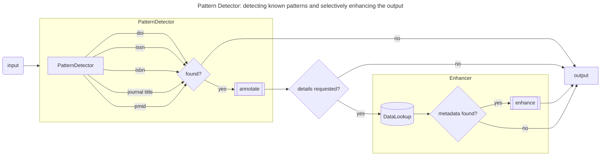

## Pattern detection and metadata enhancement

A Pattern Detector is responsible for identifying specific patterns within the input, such as using regular expressions to detect ISSN, ISBN, DOI, and PMID (implemented in our StandardIdentifiers Class). Other techniques than regular expressions may also occur as Pattern Detectors, such as doing phrase matching to identify known scientific journals, or fingerprint matching to identify librarian curated responses.

A Pattern Detector is only run when the incoming data has requested this type of information to be returned. This will take the form of requesting specific fields to be returned via GraphQL that require using Pattern Detector to populate.

An appropriate Enhancer for the specific Pattern will add more detailed metadata if requested via GraphQL. This will allow the slowest portion of this data flow -- the external data lookups (Enhancers) -- to only be run if the caller has specifically asked for that data. Some users may only be interested in knowing that patterns were found and what they were, whereas others are willing to wait longer for more detailed information. And others still won't be interested in either. **The incoming GraphQL will be the driver of which algorithms we run, and which external data we request.**

When receiving an input, first we detect known patterns such as DOI, ISSN, ISBN, PMID, or Journal Titles.

If we do not find any, we exit the flow with an empty output.

If we find one more more patterns, we annotate the eventual response with what we found. If the original input did not request details for found patterns, we return the annotated response with what we found.

If the original input did request details for found patterns, we lookup information. If we do not find additional information, we return the annotated output. If we do find additional information, we enhance the annotation with the metadata we have found and return that in the output.
