# TACOS: Tool for Analyzing and Categorization Of Searchterms

## Overview

We intend to build a solution that allows expert library staff to view anonymous raw keyword search terms from our discovery tools, provide manual categorization and commentary to help us better understand what our users are searching for categorically, and eventually help us test our search intent algorithms to correct us if we are wrong. This will be useful both for analytical purposes, but also to eventually build better search intent detection algorithms which themselves could lead to handling the searches better and eventually improving user efficiency and experience.

## Background

It is anticipated that the Discovery Steering Committee will recommend MITL use analytics to understand what users are doing, focus on improving user efficiency, and work towards systems that are better at known item searching (one example of a search category).

**This system is not a solution. It is a tool to help us make decisions.**

This system is an analytics tool that intends to initially help us confirm what users are searching for in our systems in categories. Once we analyze search terms and put them into categories we should be able to say with more certainty the types of things people are searching for so we can know where to best focus our efforts to improve user efficiency.

## The value of individual search term analysis

Our standard web analytics tool, Matomo, is good at looking at user behavior across sessions. For instance, if we are interested in how many users do a single search and then leave versus running multiple searches or how many use our basic search box versus advanced, Matomo would be a very good candidate to report on that type of information. However, Matomo will not be useful for understanding user intent with their search terms as it has not been designed to answer questions like that. We could generate reports of the raw search terms in Matomo (with some limitations) but it has no way of assigning categories or reporting on what our systems think the search intent was nor does it allow a human to grade or train that assignment.

Understanding user intent by analyzing individual search terms will be useful in multiple ways. The initial value will be our ability to generate reports on user intent based on our actual user data. Anecdotally, we believe users are mostly looking for specific, or known, items. However, we don’t have data to confirm this nor do we really understand what percentage of our searches are for specific items versus other items types. Knowing this type of information will allow us to confirm we are investing our resources in the correct problems by understanding our user needs analytically.

Beyond the initial value in understanding user search intent, **it is likely that if we could predict user intent based solely on the raw search term with some degree of accuracy, we could change how we search our backend systems in a useful way.** For example, if we are 95% confident that the search is for a specific item, we might not just throw the search term at our systems and provide a list of thousands of matches. We might instead do a targeted search in some way that produces a smaller result set with a higher certainty that the results are correct. We don’t yet know what that would look like, but the starting point is getting our systems to be able to predict whether they understand the user intent for any given search term. This categorization tool could help with that by storing a corpus of historical search terms that we could send through our algorithms to allow us to see what percentage of terms we understand and how accurate we are in that prediction. The latter part of that comes from building a staff user interface to both manually categorize search terms as well as review programmatically assigned categories.

**By partnering with our staff experts, we can both understand our current environment and start building towards an improved future environment in our discovery tools.** There may be value in looking beyond just raw isolated search terms, but for this initial system it is a solid starting point and has unique value in that our search tools currently look at each search input as unique so this tool as designed matches the current level of understanding our search systems have. If that changes in the future, we might also want to change this tool.

**Matomo is focused on what users do, while what we're talking about here is focused on what our discovery systems do.**

Additional ideas on what we might be able to achieve once we have a search corpus to identify and how expanding beyond just the raw search term may allow additional analysis opportunities in the future..

## Systems to analyze

For the initial build-out, choosing a tool that gets a lot of traffic and is fully in our control in terms of both the code and the logs will make things easier. As such, either Bento or TIMDEX API would be logical choices.

Longer term, it may be worthwhile to bring in search terms from other sources such as Primo, DSpace and ArchivesSpace to both get a broader understanding of searches while also being able to better understand how/if those tools result in different search behavior (i.e. is the percentage of specific item searches higher or lower in DSpace than Bento?).

## Staff workflows

Note: all of the workflows below assume a user has successfully authenticated via Touchstone and is authorized to use our system.

### Categorizing unmatched searches workflow

This feature would allow staff experts to login and be presented with a single specific search term that has not yet been assigned to a category. One search term at a time is an important design element that we feel is better than trying to present a list and having staff bulk categorize items.

Staff would be able to select a category, propose a new category, or choose “unknown” as well as provide a comment to describe anything they feel may be relevant to why they categorized something in a certain way. EngX staff feel this commentary would be really helpful when reviewing the data.

Submitting a categorization would lead to being presented with the next search term to categorize.

We may need to consider whether to include a “hide this searchterm” option should be provided to our staff to allow them to flag searches that may contain PII or may be otherwise problematic to include as well as why.

_Our initial minimal product will only include this staff workflow to allow us to reach out to the MITL staff we are hoping to partner with to confirm if this is something they are interested in being involved in._

```mermaid
graph TD
  A("Liaison 🧑") --> C{Dashboard}
  C --> E(View uncategorized)
  G --> E
  E --> G("Enter categorization (and optional comments)")
```

### Evaluating algorithmic matches workflow

_This workflow would be built out only after we confirm MITL staff are interested in helping us with this data by demonstrating the simpler workflow above and asking for both feedback and ongoing partnership._

This feature would allow staff experts to login and be presented with a single specific search term and the categories that have been algorithmically assigned. The user would then click rate the category match as “good”, “bad”, or “unknown”. One search term at a time is an important design element that we feel is better than trying to present a list and having staff bulk categorize items.

We’d store that rating and not show that same search to the same user again. For “unknown” responses we’d present that result to additional staff to see if their unique expertise allows them to flag the match as either “good” or “bad”.

One way to frame this is "Is this search a match with this category" (a yes/no question), but another way - down the road - might be "To which category does this search belong?" (a multiple choice question).

### Reviewing matched searches categorized by other staff workflow

As individual decisions could greatly affect the usefulness of this data longterm, we might consider having a peer review process in which searchterms that have already been categorized by one staff member are occasionally presented to another staff member without either explicitly being told who (if anyone) made the initial categorization.

This could be accomplished either by introducing a searchterm to review into the core Categorizing Unmatched Searches workflow as if it had never been reviewed. If both staff submit the same categorization, we can trust that categorization more than if just one person had done the assignment. If there is a difference, maybe we prioritize having it reviewed by a third person, etc and ultimately it might become a candidate for discussion where we describe the different categorizations we have received for a single search term and try to understand why that is happening and consider whether there is a part of the process that might need to change.

Another option would be to introduce it into the “Evaluating algorithmic matches” workflow so the reviewer would be presented with this human made match as if it were an algorithmic match. Similarly, this process would allow us to evaluate whether there are differences in how our staff are categorizing the same searchterms which will be important for us to understand how much we can trust this data overall.

## Reporting

### Overall category report

This report should be extremely useful in understanding what our users are looking for when they are using the tools we are analyzing. Do we suspect users are looking for specific items that are articles 95% of the time? This is the report that will either support or challenge that assumption.

Shows each category including: percent match in corpus, confirmed match list, possible match list.

### Algorithmic accuracy report

This report should help us understand if our algorithms are useful and accurate. If something is performing poorly, it would be a sign to remove or adjust it.

Shows useful information about each matching algorithm, including: percent match in corpus, accuracy, bad match list, unknown match list, good match list, unranked match list.

## Data loader workflows

Initially, the application will allow for upload of data from JSON files we generate by extracting searchterms from logz.io via their OpenSearch API. When we want to load more data, we can extract up to 14 days worth of searchterms, transform the data into JSON, and upload to this system for staff to analyze. A core limitation of our initial work is that we will not be trying to load a full set of every search being done in our systems and instead focusing on whether the idea for the tool is valid. Comprehensive coverage of every search may come later if useful.

Longer term, if this tool proves to be useful, it will be important for us to automate the process to extract, transform, and load the search term data as well as build a process that will allow our algorithmic predictions of categories to be loaded. This would allow us to load every search entering the search systems we are analyzing rather than small sample sets. Staff will likely not have time to manually categorize this large set of data, but having it will be useful to test/train our future algorithms. This more complex architecture will likely end up looking a lot like our TIMDEX data pipelines so we should expect this will involve AWS Step Functions, S3 buckets, lambdas/containers and collaboration with InfraEng to build out that infrastructure. However, we should not reach for this full automation until we are certain this tool as envisioned will be useful to our organization. If so, the automation will be invaluable for us to build out; if not, the automation would have been a waste of time and resources.
