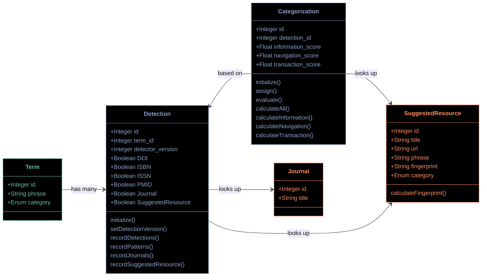
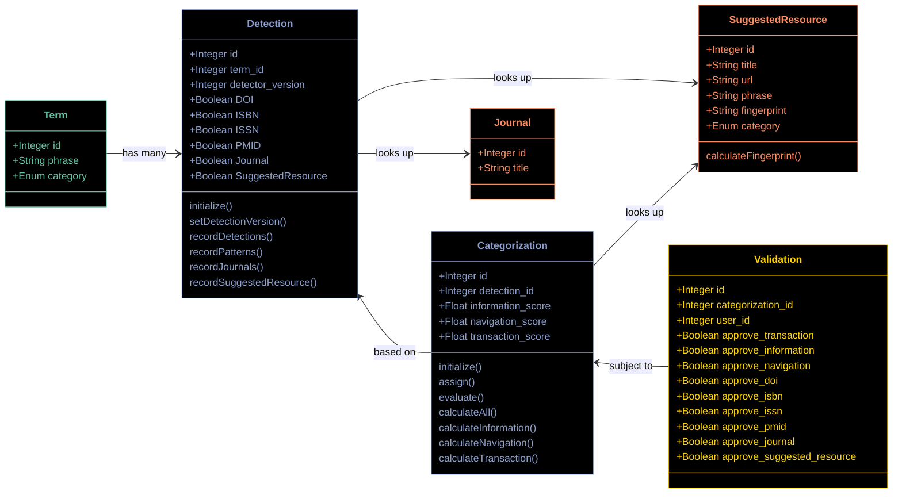

# Prototype A ("Code")

This prototype relies on fewer tables, with one record in each, and leans more heavily on behavior in code.

## Shared preface

The same color scheme is used for both prototypes:

* <font style="color:#66c2a5">Terms</font>, which flow in continuously with Search Events;
* A <font style="color:#fc8d62">knowledge graph</font>, which includes the categories, detectors, and relationships
  between the two which TACOS defines and maintains, and which is consulted during categorization; and
* The <font style="color:#8da0cb">linkages between these terms and the graph</font>, which record which signals are
  detected in each term, and how those signals are interpreted to place the term into a category.

A simple way to describe the Categorization workflow would be to say that Categorization involves populating the blue
tables in the diagrams below.

## Categorization



### Order of operations

1. A new `Term` is registered.
2. A `Detection` record for that `Term` is created (which allows repeat detection operations as TACOS gains new
   capabilities).
3. The various `Detection` records (either the most recent for each term, or all detections over time) are processed via
   code to generate scores for each potential category. These results are stored as `Categorization` records.
4. The three category scores are compared, and the one with the highest score is stored back in the `Term` record.

### Category values

There is no `Category` table, but two models have separate enumerated fields. The `Detector::SuggestedResource` model
has three possible values (Informational, Navigational, and Transactional), while the `Term` model has an additional
value ("Unknown") which is assigned during Categorization if two category scores are equal.

(This lack of a category table is not a fundamental aspect of this prototype, but it does indicate the general choice to
rely on code, rather than database records, as much as possible. Such a model could be accommodated, or implemented via
a shared helper method perhaps)

### Calculating the category scores

At the moment, category scores are assigned in methods like:

```ruby
# FILE: app/models/categorization.rb
  def calculate_transactional
    self.transaction_score = 0.0
    self.transaction_score = 1.0 if %i[doi isbn issn pmid journal].any? do |signal|
      self.detection[signal]
    end
    self.transaction_score = 1.0 if Detector::SuggestedResource.full_term_match(self.detection.term.phrase).first&.category == 'transactional'
  end
```

This is effectively an "all or nothing" approach, where any detection at all results in the maximum possible score. This
lacks nuance, obviously, and we've talked about ways to include a confidence value in these calculations. As yet, this
prototype has not attempted to include that feature however.

**Note:** I've tried to anticipate how to include confidence values appropriately in this prototype, and it is not at
all clear how that might happen. This gets to the mathematical operations involved in calculating the category scores,
which might need to be documented separately. I've started a [Tidbit article to explore this issue](https://mitlibraries.atlassian.net/wiki/spaces/D/pages/4019814405/Calculating+categorization+scores+via+confidence+values).

## Validations



Validations, in this prototype, are collected in a single table with a field for each decision which came before it. As
the application expands, any new detectors or categories would result in new fields, both in the Detection or
Categorization models and also in the Validation model.

Multiple validations are possible for a single Categorization decision, enabled by the user_id field, which allows for
feedback provided by multiple users if bandwidth allows.
