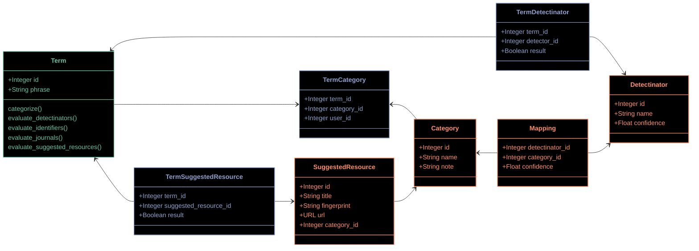
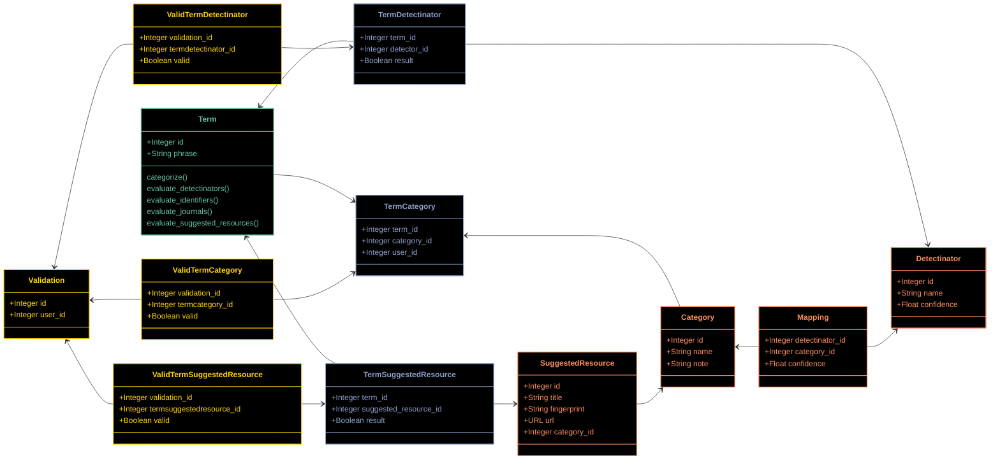

# Prototype B ("Data")

This prototype relies on more models, more linking records, and as a result relies less on behavior in code.

## Shared preface

* Terms, which flow in continuously with Search Events;
* A knowledge graph, which includes the categories, detectors, and relationships
  between the two which TACOS defines and maintains, and which is consulted during categorization; and
* The linkages between these terms and the graph, which record which signals are
  detected in each term, and how those signals are interpreted to place the term into a category.

A simple way to describe the Categorization workflow would be to say that Categorization involves populating the blue
tables in the diagrams below.

## Categorization

### The "knowledge graph"

The relationship between Detectors and Categories would be generally set ahead of time. Detectors produce a boolean
output in the cleanest case - they either detect a signal or they do not. Relatedly, detectors have an influence over
whether a given Category is relevant or not:

* If the Detector for a DOI pattern returns `true`, then this influences the `transactional` Category to a significant
  degree.
* However, the Detector for a DOI pattern does almost nothing to influence the `navigational` Category.
* If Categorization is a zero-sum activity, however, the DOI pattern detector would _exclusively_ claim a Term for the
  `transactional` Category - so it would effectively rule out the other two Categories.

The exception to this Detector rule is the SuggestedResource detector - which has variability in its records. Some
SuggestedResources are in each of the three Categories, so there is a more complicated decision-making algorithm, and
thus a different set of database tables.

### Category scores

At the moment, category scores are intended to be calculated by combining the confidence values for both the detector
and the DetectorCategory link (as well as the result of the detection pass, if negative results are stored). See the
workflow document for this prototype for an explanation of this math. I've begun an implementation of this approach
in the `Term.categorize` method in this prototype, but this is not finished.

### Order of operations

The linkages between these tables are filled in at different moments.

The Detector-Category linkage is maintained as either set of resources evolves over time, and on a relatively slow
cadence. Operationally, the links which matter are made as new Terms flow into TACOS.

1. A new Term is recorded in the system.
2. That Term is compared with each Detector, and any positive responses are recorded. Negative responses may be
   discarded, or recorded for the sake of completeness (to confirm that the link was tested). These outcomes are stored
   as several records across the TermDetectinator and TermSuggestedResource tables.
3. Those detection records are then used to perform the Categorization work, comparing the confidence values of each
   Detectinator and Mapping. The responses are then used to perform the Categorization work, which results in records
   being created in the TermCategory table.

### Questions

* The application defines a `Detector` module/namespace. Ideally I want a `Detector` class for the records of our
  various detectors, but I'm not sure this is possible (or I haven't figured out how). If `Detector` is not possible,
  should we use an un-namespaced option like `Detectinator`, or instead go with something like `Detector::Detector` or
  `Detector::Base` ?
  * One of the reasons why I went with an un-namespaced class here is to make defining link tables easier
    (`Term_Detectinator` instead of `Term_DetectorBase`)
* The `TermDetectinator` table records the results of our suite of detectors in response to a given term. Should we
  record only positive results, or should we also record negative results?
  * The `Mappings` table (which should be named `CategoryDetectinator`) has a similar question - whether we should
    record no-confidence mappings (for example, a DOI detection would have 0 confidence toward a navigational
    categorization)

## Validations

Valdations might get thorny in this model, because the results we are validating are spread across multiple records in
the same class. For example, a single term record like `Collins HK. When listening is spoken. doi: 10.1016/j.copsyc.2022.101402. PMID: 35841883.`
would result in multiple records in the `TermDetectinator` table, each of which would be subject to validation. As a
result it might make sense to embed the validation throughout the data model, rather than in a separate field?

This is an extension of the original class diagram, adding the validation data model in yellow. The thesis of the model
is that every decision made during Categorization is subject to review during Validation, potentially by multiple
reviewers.

If validation is only performed once, we don't need any of the yellow tables, and we instead could just add a boolean
`valid` flag to each categorization table.