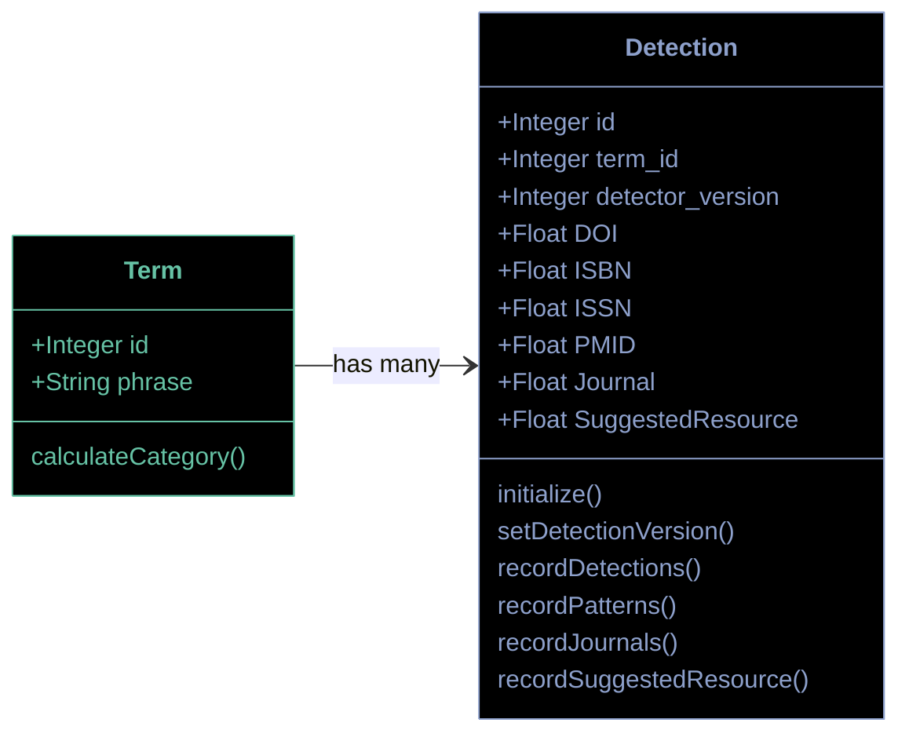

# Prototype C ("Detections with confidence")

This prototype relies on fewer tables, with one record in each, and leans more heavily on behavior in code.

> [!WARN]
> The intent was to collapse Categorizations into Detections by moving booleans to floats, but this looses important
nuance from the original prototype A-minus it was based on.

## Shared preface

The same color scheme is used for both prototypes:

* Terms, which flow in continuously with Search Events;
* A knowledge graph, which includes the categories, detectors, and relationships
  between the two which TACOS defines and maintains, and which is consulted during categorization; and
* The linkages between these terms and the graph, which record which signals are
  detected in each term, and how those signals are interpreted to place the term into a category.

A simple way to describe the Categorization workflow would be to say that Categorization involves populating the blue
tables in the diagrams below.

## Categorization

### Order of operations

1. A new `Term` is registered.
2. A `Detection` record for that `Term` is created (which allows repeat detection operations as TACOS gains new
   capabilities). Rather than storing a boolean, we store a float to represent how confident we are that the detection is able to be used for categorization. This approach feels flawed

### Category values

Not worked out as the model seems flawed and was abandoned after initial discussion.

### Calculating the category scores

Not worked out as the model seems flawed.

## Validations

Not worked out as the model seems flawed.
