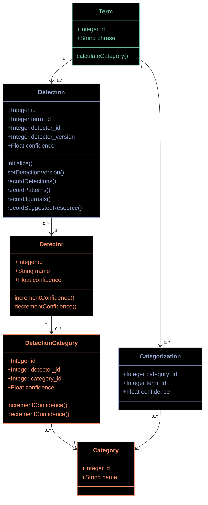

# Prototype D ("Detectors have many Detections")

This prototype focuses attempts to only store positive detections, which seems valuable as most of our Terms have no `Detections` and other Prototypes stored "misses" in addition to "hits".

This comes at the cost of potentially storing more than one `Detection` for some Terms (i.e. if an ISSN and a JournalName match, we'll store 2 `Detection` records).

`Category` and `Categorization` are optional tables. They would serve as a sort of cache for the `calculateCategory()` method for a `Term`. This allows a `Term` to have multiple categories and would serve as as way to quickly report on what we know about the system rather than calculating everything on the fly. As each `Categorization` stores a confidence float, this should allow us to return to consuming systems how confident we are in each `Category` we return.

`Detector` is a place where we keep track of each algorithm we have coded and how confident we are in it's ability to predict a Category.

## Shared preface

The same color scheme is used for both prototypes:

* Terms, which flow in continuously with Search Events;
* A knowledge graph, which includes the categories, detectors, and relationships
  between the two which TACOS defines and maintains, and which is consulted during categorization; and
* The linkages between these terms and the graph, which record which signals are
  detected in each term, and how those signals are interpreted to place the term into a category.

A simple way to describe the Categorization workflow would be to say that Categorization involves populating the blue
tables in the diagrams below.

## Categorization

### Order of operations

1. A term enters the system
2. If Categories exist, return the existing Categories.
3. If no Categories exist, run all Detectors and create Detection and Categorization records. If no Detections are made, we should consider Categorizing the Term as "Unknown" Category to allow for not running Detections again.
4. If new Detectors are created/adjusted. Categorizations should be deleted or expired in some way to allow for new Detections/Categorizations to be created.

### Category values

These are largely algorithmic in this model. We'd know what was detected from the Detections table and the `Term` or `Category` model would handle `Categorization` based on business logic we put in place. Example, having a DOI is high confidence for being a Specific Item.

Unsolved in this model: one Detector (so far) has `Categories` built into the `Detector` (SuggestedResources). These would need to be passed into the `calculateCategory()` method in some way to allow for appropriate `categorization`.

### Calculating the category scores

One interesting feature of DetectionCategory is that it stores the confidence of each algorithm to accurately predict a category. During validation, if a Detection made by an algorithm is confirmed, we can run `incrementConfidence()` whatever that ends up meaning. Similarly, if an Detection is validated as inaccurate, we can run `decrementConfidence()`.

> [!NOTE]
>DetectionCategory is a join table represented in Prototype B as `mapping`. This tries to nudge it towards a better name.

Some detectors are themselves non-binary in terms of prediction so they maintain a confidence level as well (namely JournalName detection is fairly weak compared to many other algorithms to date)

## Validations

