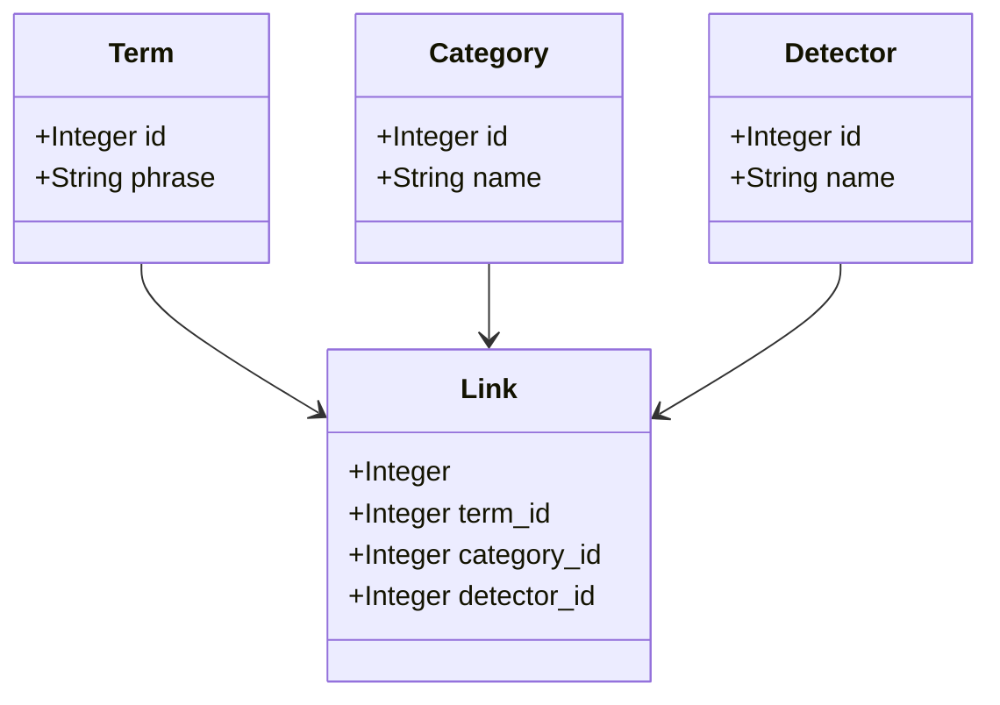

# Prototype Zero

This was the simplest possible way to join the three basic resources (Terms, Detectors, and Categories).

This was not developed further, because the other two prototypes (A and B) immediately seemed more capable than this
approach. Having a single join table link all three resources is a recipe for duplicate and inconsistent data that is
hard to work with.

It is included here only for the sake of completeness.
