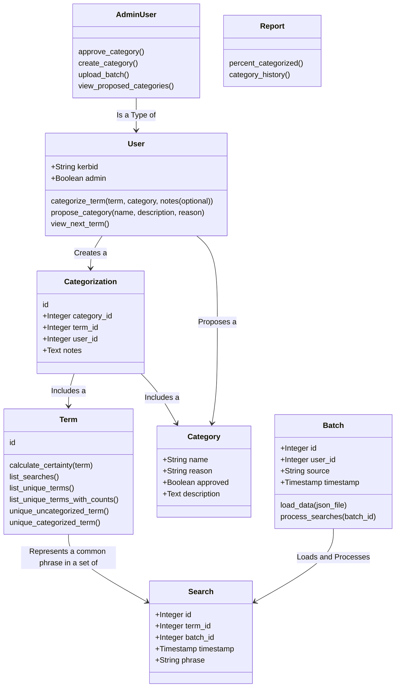

```mermaid
classDiagram
  direction TB
  
  AdminUser --> User : Is a Type of
  Term --> Search : Represents a common phrase in a set of

  User --> Categorization : Creates a
  User --> Category : Proposes a
  Batch --> Search : Loads and Processes
  Categorization --> Term : Includes a
  Categorization --> Category : Includes a

  class Term
    Term
    Term: id
    Term: calculate_certainty(term)
    Term: list_searches()
    Term: list_unique_terms()
    Term: list_unique_terms_with_counts()
    Term: unique_uncategorized_term()
    Term: unique_categorized_term()
    Term: 

  class Search
    Search: +Integer id
    Search: +Integer term_id
    Search: +Integer batch_id
    Search: +Timestamp timestamp
    Search: +String phrase

  class User
    User: +String kerbid
    User: +Boolean admin
    User: categorize_term(term, category, notes (optional))
    User: propose_category(name, description, reason)
    User: view_next_term()
  
  class AdminUser
    AdminUser: approve_category()
    AdminUser: create_category()
    AdminUser: upload_batch()
    AdminUser: view_proposed_categories()

  class Batch
    Batch: +Integer id
    Batch: +Integer user_id
    Batch: +String source
    Batch: +Timestamp timestamp
    Batch: load_data(json_file)
    Batch: process_searches(batch_id)

  class Category
    Category: +String name
    Category: +String reason
    Category: +Boolean approved
    Category: +Text description

  class Categorization
    Categorization: id
    Categorization: +Integer category_id
    Categorization: +Integer term_id
    Categorization: +Integer user_id
    Categorization: +Text notes

  class Report
    Report: percent_categorized()
    Report: category_history()
```
