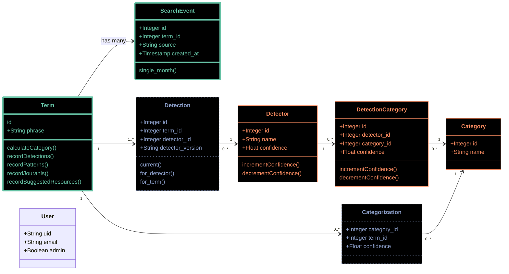

# Modeling categorization

The application includes the following entities, most of which an be broken into one of the following three areas:

* Search activity, which flow in continuously with Terms and Search Events;
* A knowledge graph, which includes the categories, detectors, and relationships
  between the two which TACOS defines and maintains, and which is consulted during categorization; and
* The linkages between these search terms and the graph, which record which signals are
  detected in each term, and how those signals are interpreted to place the term into a category.

