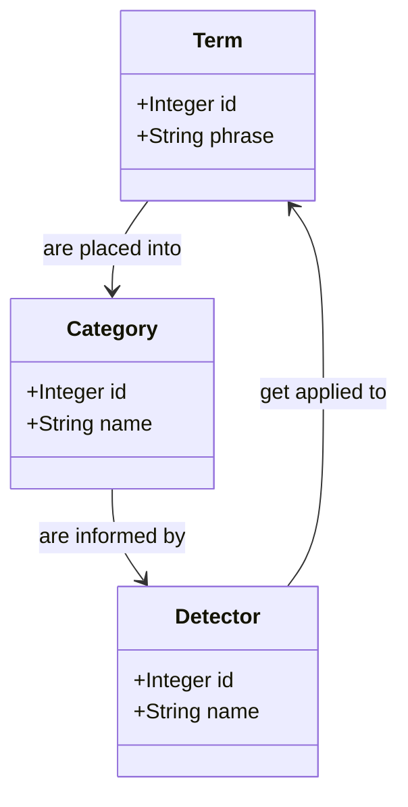

# Modeling categorization

## Initial proposal

---

## Conceptual diagram

There are three basic models which we are attempting to relate to each other:
Terms, Detectors, and Categories. The relationship looks like this:

Some sample data in each table might be:

### Terms

| id | phrase                                |
|----|---------------------------------------|
| 1  | web of science                        |
| 2  | pitchbook                             |
| 3  | vaibbhav taraate                      |
| 4  | doi.org/10.1080/17460441.2022.2084607 |
---

We have received more than 40,000 unique search terms from the Bento system in
the first three months of TACOS operation.

### Categories

| id | name          | note                                                                                      |
|----|---------------|-------------------------------------------------------------------------------------------|
| 1  | Transactional | The user wants to complete an _action_ (i.e. to receive an item)                          |
| 2  | Navigational  | The user wants to reach a _place_ which might be a web page, or perhaps talk to a person. |
| 3  | Informational | The user wants _information_ about an idea or concept.                                    |

Thus far, we have only focused on these three categories of search intent. It
should be noted that the SEO literature references additional categories, such
as "commercial" or "conversational".

Additionally, some of these categories may be sub-divided. Transactional
searches might be looking for a book, a journal article, or a thesis.
Navigational searches might be satisfied by visiting the desired webpage, or
contacting a liaison.

### Detectors

| id | name               | note            |
|----|--------------------|-----------------|
| 1  | DOI                | Regex detection |
| 2  | ISBN               | Regex detection |
| 3  | ISSN               | Regex detection |
| 4  | PMID               | Regex detection |
| 5  | Journal name       | Term lookup     |
| 6  | Suggested resource | Term lookup     |

---

Further discussion of the class diagram can be found in the three prototype files:

* [Prototype zero (abandoned)](./classes-prototype-zero.md)
* [Prototype A ("Code")](./classes-prototype-a.md)
* [Prototype B ("Data")](./classes-prototype-b.md)
