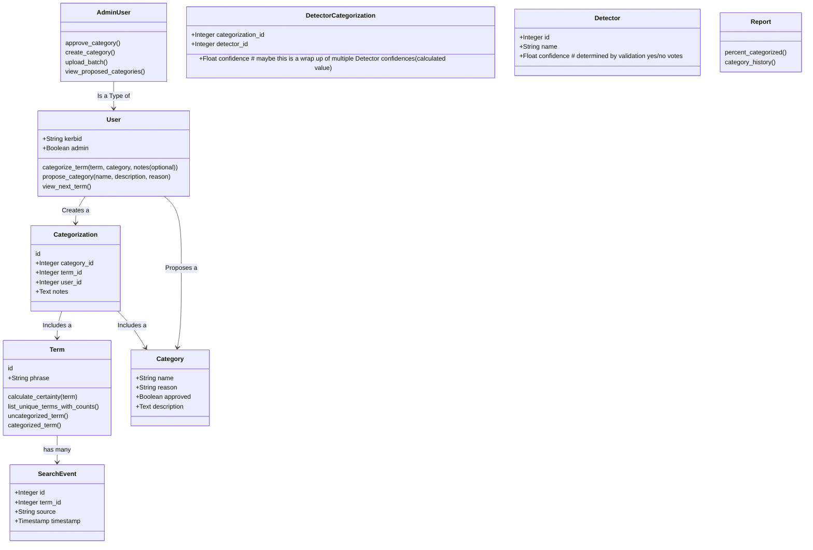
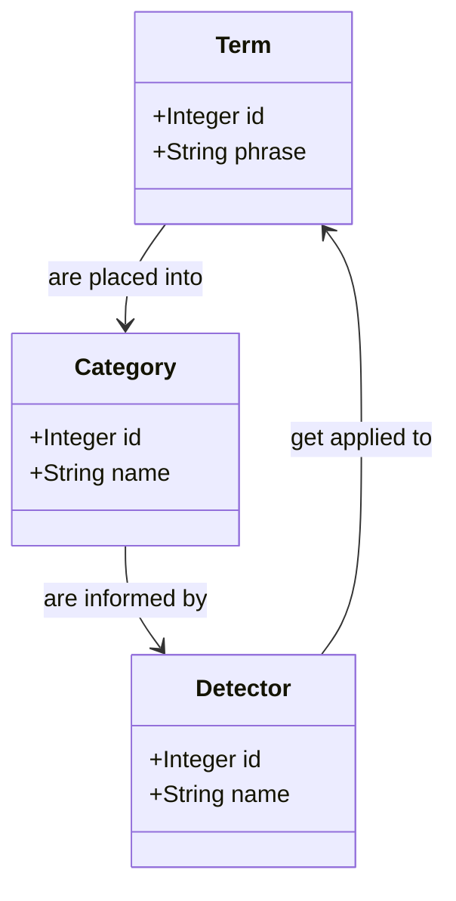
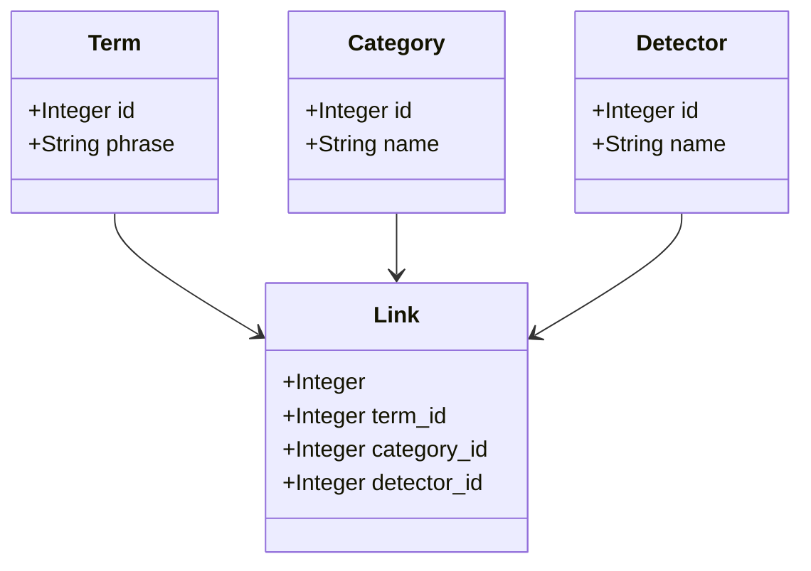
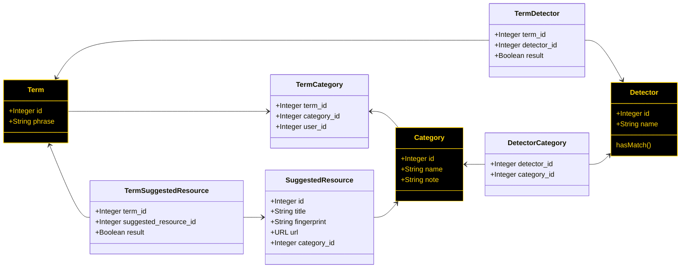
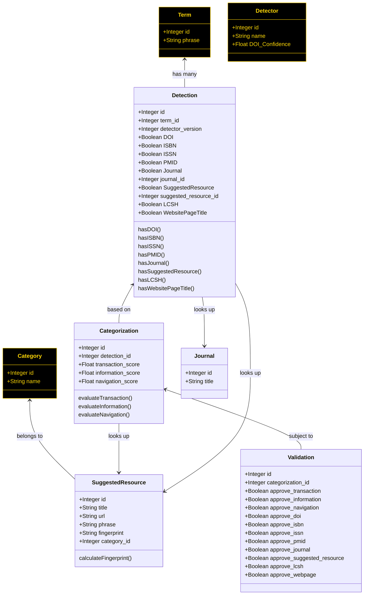

# Modeling categorization

## Initial proposal

---

## Conceptual diagram

There are three basic models which we are attempting to relate to each other:
Terms, Detectors, and Categories. The relationship looks like this:

Some sample data in each table might be:

### Terms

| id | phrase                                |
|----|---------------------------------------|
| 1  | web of science                        |
| 2  | pitchbook                             |
| 3  | vaibbhav taraate                      |
| 4  | doi.org/10.1080/17460441.2022.2084607 |
---

We have received more than 40,000 unique search terms from the Bento system in
the first three months of TACOS operation.

### Categories

| id | name          | note                                                                                      |
|----|---------------|-------------------------------------------------------------------------------------------|
| 1  | Transactional | The user wants to complete an _action_ (i.e. to receive an item)                          |
| 2  | Navigational  | The user wants to reach a _place_ which might be a web page, or perhaps talk to a person. |
| 3  | Informational | The user wants _information_ about an idea or concept.                                    |

Thus far, we have only focused on these three categories of search intent. It
should be noted that the SEO literature references additional categories, such
as "commercial" or "conversational".

Additionally, some of these categories may be sub-divided. Transactional
searches might be looking for a book, a journal article, or a thesis.
Navigational searches might be satisfied by visiting the desired webpage, or
contacting a liaison.

### Detectors

| id | name               | note            |
|----|--------------------|-----------------|
| 1  | DOI                | Regex detection |
| 2  | ISBN               | Regex detection |
| 3  | ISSN               | Regex detection |
| 4  | PMID               | Regex detection |
| 5  | Journal name       | Term lookup     |
| 6  | Suggested resource | Term lookup     |

## One central join table

---
# Sets of two-way join tables

The principle resources are Terms, Categories, and Detectors. Terms flow in
continuously. Detectors are less fluid, but might still be expected to change as
we improve our operations. Categories are the slowest changing.

The relationship between Detectors and Categories would be generally set ahead
of time. Detectors produce a boolean output in the cleanest case - they either
detect a signal, or they do not. Relatedly, detectors have an influence over
whether a given Category is relevant, or not:

* If the Detector for a DOI pattern returns `true`, then this influences the
  `transactional` Category to a significant degree.
* However, the Detector for a DOI pattern does almost nothing to influence the
  `navigational` Category.
* If Categorization is a zero-sum activity, however, the DOI pattern detector
  would _exclusively_ claim a Term for the `transactional` Category - so it
  would effectively rule out the other two Categories.

The exception to this Detector rule is the SuggestedResource detector - which
has variability in its records. Some SuggestedResources are in each of the three
Categories, so there is a more complicated decision-making algorithm, and thus
a different set of database tables.

## Order of operations

The linkages between these tables are filled in at different moments.

The Detector-Category linkage is determined as either set of resource is made,
and on a relatively slow cadence. Operationally, the links which matter are made
as new Terms flow into TACOS.

1. A new Term is recorded in the system.
2. That Term is compared with each Detector, and any positive responses are
   recorded. Negative responses may be discarded, or recorded for the sake of
   completeness (to confirm that the link was tested).
3. Those Term-Detector responses are then used to perform the Categorization
   work, which results in records being created in the TermCategory table.

---

# Less "pure" implementation

This makes the order of operation a bit more explicit:

1. A new Term is registered.
2. The Detection table entry for that Term is populated (which allows repeat
   Detection passes as the detector models change).
3. The output of various Detection passes (either the most recent for each term,
   or all detections over time) are processed via code to generate scores for
   each potential category.